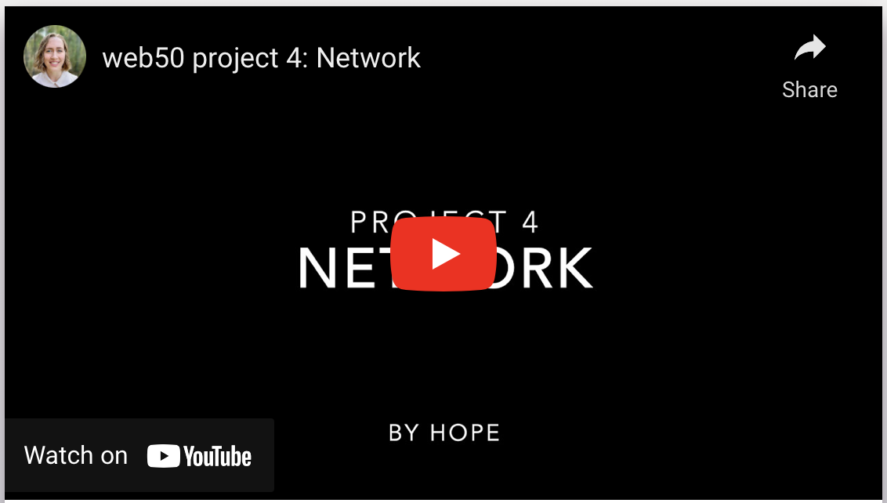

# Social Network

## Technologies
* Python
* Django
* JavaScript
* HTML
* CSS
* API routes

## Summary

This is a Twitter-like social network where logged-in users can post and edit 140-character status updates, view the status feed of users they follow (or of all users on the site), and view individual user profiles to see their friends' status updates and total follower/follows count. Users can follow/ unfollow each other through their individual profile pages, and "like" or "unlike" posts (which asynchronously updates the message's status on the server with fetch).

## Video Demo

---

Assignment starter code provided by Harvard's CS50. You can read the full assignment description on [CS50's OpenCourseWare](https://cs50.harvard.edu/web/2020/projects/4/network/)